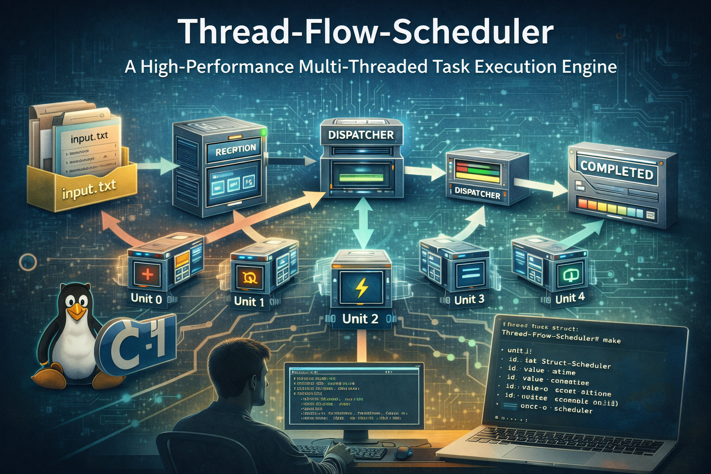

<div align="center">

# 🧵 Thread-Flow-Scheduler
>##  **A High-Performance Multi-Threaded Task Execution Engine**




</div>

---

**Thread-Flow-Scheduler** is a multi-threaded task execution engine developed for the University of Khartoum Operating Systems course. The system simulates a distributed processing environment where tasks are ingested from an input file, queued, and dispatched across specialized processing units (threads) according to a predefined sequence.

---

## 🏗 System Architecture

The project implements a **Pipeline Architecture**. Tasks flow through various stages of processing, managed by a central dispatcher and dedicated worker threads.


### Workflow Components:
1.  **Receptor**: Ingests data from the input file and timestamps arrival using high-resolution timers.
2.  **Waiting Queue**: A central thread-safe buffer for incoming tasks.
3.  **Dispatcher**: The "Brain" of the system—routes tasks to the appropriate unit based on their current progress.
4.  **Processing Units (0-4)**: Five specialized threads, each managing its own local queue and performing distinct mathematical operations.

---

## 🏗 System Diagram
**The project follows a pipeline architecture designed to manage task flow through asynchronous processing units:**

```text
           +------------+      +-----------+      +---------------+
           | Input File | ---> | Reception | ---> | Waiting Queue |<<-------------<<<<<<<<<<<<<<<<<<<<<<<<<------------------
           +------------+      +-----------+      +-------+-------+                                                         |
                                                          |                                                                 |
                                                   +------v-----+                                                           |
                                                   | Dispatcher |                                                           |
                                                   +------+-----+                                                           |
                                                          |                                                                 |
          +-----------------------------------------------+-----------------------------------------------+                 |
          |                        |                      |                        |                      |                 |
    +-----v------+           +-----v------+         +-----v------+           +-----v------+         +-----v------+          |
    | Unit 0 Q   |           | Unit 1 Q   |         | Unit 2 Q   |           | Unit 3 Q   |         | Unit 4 Q   |          |
    +-----+------+           +-----+------+         +-----+------+           +-----+------+         +-----+------+          |
          |                        |                      |                        |                      |                 |
    +-----v------+           +-----v------+         +-----v------+           +-----v------+         +-----v------+          |
    |   Unit 0   |           |   Unit 1   |         |   Unit 2   |           |   Unit 3   |         |   Unit 4   |          |
    +-----+------+           +-----+------+         +-----+------+           +-----+------+         +-----+------+          |
          |                        |                      |                        |                      |                 |
          +------------------------+----------------------+------------------------+----------------------+                 |
                                                          |                                                                 |
                                                          |->---------------------->>>>>>>>>>>>>>>>>>>>>>>-------------------
                                                          |
                                                  +-------v-------+
                                                  |   Completed   |
                                                  +---------------+
```
---

## ⚡ Processing Unit Operations

Each unit simulates a 0.5s workload and applies a specific transformation. (Note: $M = 10,000$ for modulo operations).

| Unit ID | Icon | Operation | Description |
| :--- | :---: | :--- | :--- |
| **0** | ➕ | `(value + 7) % M ` | Incremental offset |
| **1** | ✖️ | `(value * 2) % M ` | Doubling logic |
| **2** | ⚡ | `(value^5) % M ` | Exponential transformation |
| **3** | ➖ | `value - 19 ` | Negative offset |
| **4** | 📤 | `print` | Final output & Termination |

---

## 📄 Data Specifications

### Task Structure
Tasks are represented using a dynamic C structure to track their journey through the pipeline:

```c
struct task {
    int id;            // Unique identifier
    int value;         // Value operated on by units
    int atime;         // Arrival timestamp
    int unit_count;    // Total sequence length
    int *unit_id;      // Ordered list of Unit IDs to visit
};

```

### Input Format (`input.txt`)

`<Task-id> <Task-Value> <units-count> <unit-id-1> <unit-id-2> ...`

**Example:**
`0 123 4 0 0 4 2` → *Task 0 starts with 123, visits Unit 0 twice, then Unit 4, then Unit 2.*

---

## 📂 Project Structure


```text
Thread-Flow-Scheduler/
├── src/
│   ├── main.c           # Thread spawning & cleanup
│   ├── receptor.c       # File ingestion
│   ├── dispatcher.c     # Routing logic
│   ├── units.c          # Worker thread logic
│   └── waitingg_queue.c # Thread-safe waiting queue (Mutex/Cond Vars)
│   └── unit_queue.c     # Thread-safe unit queue (Mutex/Cond Vars)
├── include/
│   └──project.h        # Global data
├── Makefile             # Build script
└── input.txt            # Data file

```


---

## 🚀 Getting Started

### Prerequisites

* **OS**: POSIX-compliant (Linux, macOS, WSL2)
* **Compiler**: `gcc`
* **Dependencies**: `lpthread`, `lrt`

### Installation & Execution

1. **Clone the repository**
```bash
git clone https://github.com/Ibraheem-Al-hafith/Thread-Flow-Scheduler.git
cd Thread-Flow-Scheduler
```
2. **Compile the source**:
```bash
make

```


3. **Run the scheduler**:
```bash
./scheduler_flow

```

---

## 👥 The Development Team

* 🧬 **Concurrency & Sync**: Mohammed Salah Ahmed & Mosab Taha Ahmed
* 📂 **File I/O & Receptor**: Awaab Abdelrafia Ballah
* 🎮 **Dispatcher & Units**: Ibrahim Alhafith Alkhair & Rashed Albasheir Suliman

---

<h1 align="center">University of Khartoum - Faculty of Mathematical Science and Informatics</h1>


